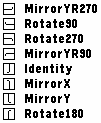

special-draw-transform
======================

An efficient way to apply simple transformations (any combination of mirroring
and rotation by multiples of 90 degrees.)

```c
GSpecialSessionModifier *
    graphics_special_draw_create_transform_modifier(
         GRect area, GSpecialTransformationType type);
```

Creates a transform modifier. Supply any of the following
`GSpecialTransformationType`s:

```c
GSpecialTransformMirrorYR270
GSpecialTransformRotate90
GSpecialTransformRotate270
GSpecialTransformMirrorYR90
GSpecialTransformIdentity
GSpecialTransformMirrorX
GSpecialTransformMirrorY
GSpecialTransformRotate180
```



Rotation must be supplied with a _square_ area.

Technical details
-----------------

Uses 2&times;2 linear transformation matrices in which only -1, 0, and 1 are
supported. Two fields must be 0 diagonally. All of the 8 possible combinations
are already predefined as a `GSpecialTransformationType`.

If you'd like to extend these abilities, please open an issue or PR!
